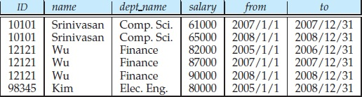

> What is temporal database? What are its characteristics? [5M]
***
#### Temporal database [1M]
Databases that store information about states of the real world across time are called temporal databases.
In many applications, it is important to store and retrieve information about past states. 
For example, a patient database must store information about the medical history of a patient. 
A factory monitoring system may store information about current and past readings of sensors in the factory, for analysis.

#### Characteristics [3M]
- The **valid time** for a fact is the set of time intervals during which the fact is true in the real world.
- The **transaction time** for a fact is the time interval during which the fact is current within the database system.
- A **temporal relation** is one where each tuple has an associated time when it is true; the time may be either valid time or transaction time.
- If both valid time and transaction time are stored, then the relation is called a **bitemporal relation**.
- A **temporal selection** is a selection that involves the time attributes.
- A **temporal projection** is a projection where the tuples in the projection inherit their times from the tuples in the original relation
- A **temporal join** is a join, with the time of a tuple in the result being the intersection of the times of the tuples from which it
is derived. If the times do not intersect, the tuple is removed from the result.
- The predicates precedes, overlaps, and contains can be applied on intervals.
#### Example temporal relation - instructor (includes valiation time with attributes from and to)

