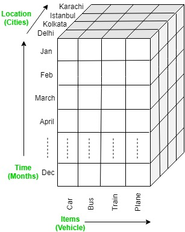
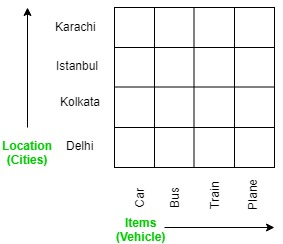
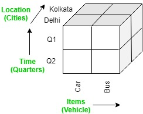
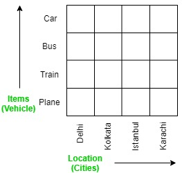

> Explain roll-up, drill down, slice, dice operations in OLAP. [5M]
***
#### OLAP Roll-up operation [1M]
It performs aggregation on the OLAP cube. 
It can be done by climbing up in the concept hierarchy or reducing the dimensions.
Example roll-up operation is performed by climbing up in the concept hierarchy of Location dimension (City -> Country).

 | roll-up | 
---|---|---

#### OLAP Drill-down operation [1M]
In drill-down operation, the less detailed data is converted into highly detailed data. It can be done by Moving down in the concept hierarchy or Adding a new dimension. Example drill down operation is performed by moving down in the concept hierarchy of Time dimension (Quarter -> Month).

 | drill-down | 
---|---|---

#### OLAP Slice operation [1M]
The slice operation performs a selection on one dimension of the given cube. Example Slice is performed on the dimension Time = "Q1".

#### OLAP Dice operation [1M]
Dice operation defines a subcube by performing a selection on two or more dimensions. Example a sub-cube is selected by selecting following dimensions with criteria:
- Location = “Delhi” or “Kolkata”
- Time = “Q1” or “Q2”
- Item = “Car” or “Bus”

All images [1M]
***
#### OLAP Pivot operation
It is a visualization operation that rotates axes in view in order to provide an alternative presentation of the data. Example -

 | pivot | 
---|---|---
