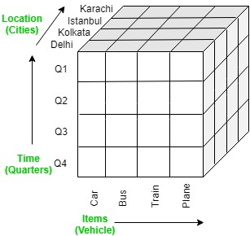
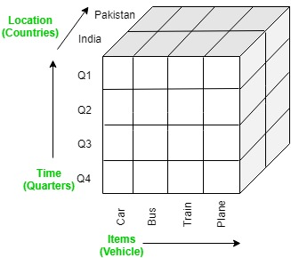

> Explain roll-up, drill down, slice, dice operations in OLAP. [5M]
***
#### OLAP Roll-up operation [1M]
It performs aggregation on the OLAP cube. 
It can be done by climbing up in the concept hierarchy or reducing the dimensions.
Example roll-up operation is performed by climbing up in the concept hierarchy of Location dimension (City -> Country).

 | => | 
---|---|---
